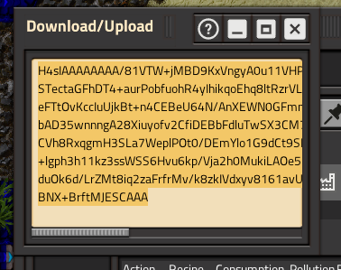

# factorio-router
A simple program to come up with an inefficient routing plan for all your factory machines and supplies.

Intended to consume a json object containing the output of Helmod Factorio Calculator's export. We export a basic blueprint with an inefficient layout (route) of inputs to machines.

## Usage
Export a "Production Line" in Helmod and copy to clipboard

Then run this command
`pbpaste | xargs python main.py` (or manually paste and pipe inputs into main.py)

## setup without docker on mac
- [ ] `source venv/bin/activate`
- [ ] `pip3 install -r requirements.txt`
- [ ] `brew install lua`
- [ ] `brew install luarocks`
- [ ] `luarocks install serpent`
- [ ] paste your contents into input.txt
- [ ] `cat input.txt | xargs python main.py`

## setup with docker :)
- [ ] docker-compose build main
- [ ] docker-compose up