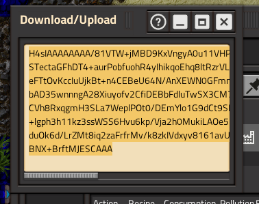

# factorio-router

[](https://sonarqube.us/summary/new_code?id=afloresescarcega_factorio-router)

A simple program to come up with an inefficient routing plan for all your factory machines and supplies.

This project consumes a Helmod Factorio Calculator's export string and produces a basic blueprint with an inefficient layout (route) of inputs to machines.

## Setup

1. Ensure you have Python 3.7 or later installed on your system.
2. Clone this repository:
   ```
   git clone https://github.com/afloresescarcega/factorio-router.git
   cd factorio-router
   ```
3. Install the required Python packages:
   ```
   pip install -r requirements.txt
   ```

## Usage

1. Export a "Production Line" in Helmod and copy it to your clipboard:
   

   

2. Save the Helmod export string to a file named `input.txt` in the project directory.

3. Run the main script:
   ```
   python main.py
   ```

   Alternatively, you can pipe the input directly:
   ```
   cat input.txt | python main.py
   ```

## How it works

1. The `helmod_factory.py` script decodes the Helmod export string, which is a base64-encoded, gzipped Lua table.
2. The decoded data is then processed to create a Factorio blueprint with an inefficient but functional layout of machines and items.
3. The resulting blueprint string is printed to the console, which you can then import into Factorio.

## Contributing

Contributions are welcome! Please feel free to submit a Pull Request.

## License

This project is open source and available under the [MIT License](LICENSE).
