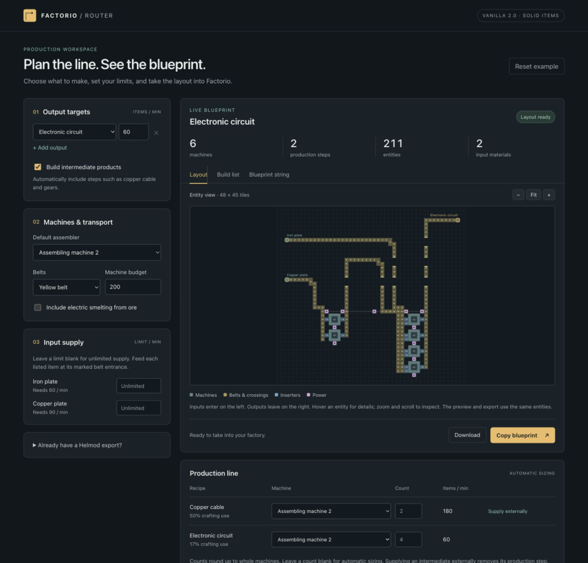

# Factorio Router

Configure a production line, inspect its layout, and export a Factorio 2.0 blueprint. Everything runs in the browser. No account, backend, Python installation, Helmod mod, or external blueprint viewer is required.

[**Open Factorio Router →**](https://afloresescarcega.github.io/factorio-router/)

[](https://github.com/afloresescarcega/factorio-router/actions/workflows/deploy-pages.yml)
[](https://sonarqube.us/summary/new_code?id=afloresescarcega_factorio-router)



## What you can do

- Set up to 45 output targets and available input rates in items/min, items/sec, or full-belt equivalents, with output lane saturation shown directly.
- Use yellow, red, blue, or Space Age green belts, with independent optional input and output stacks of 2–4 items.
- Build intermediate products automatically or supply them externally.
- Choose machine and belt tiers, enforce a machine budget, and override counts per recipe.
- Enable optional compact placement to reduce the blueprint footprint while preserving production targets and machine counts.
- Inspect the exact exported layout with zoom, input/output labels, and a complete build list.
- Copy or download a blueprint string. Optional Helmod imports become editable in the same planner.

## Run

Use Node.js 22.13+ (or 24+).

```sh
cd frontend
npm ci
npm start
```

Open the local URL printed by Vite. `npm run build` produces a static site in `frontend/dist`, including support for GitHub Pages subpaths. The existing Pages workflow builds and deploys that directory.

## Plan a line

1. Choose one or more outputs and their target rates. The unit selector switches the workspace between **items/min**, **items/s**, and **Belts**, converting existing targets and supply limits together. One belt means both lanes at the selected belt tier and the relevant input/output stack height. For example, 0.5 green belts at 4 high means 120 items/s or 7,200 items/min. The current layout uses one lane per material; targets requiring parallel belts are blocked. In Belts mode, changing the tier or stack height changes the requested item rate; item-based targets stay fixed.
2. Choose an assembler tier, belt tier, and total machine budget. Enable automatic intermediates to include recipes such as gears and cable. Enable electric smelting to start from ore. Turn on **Compact layout** to try tighter placement; leave it off for the original layout.
3. Enter available input rates, or leave them blank for unlimited supply. You can supply any intermediate externally from the production table. Optional **Belt stacking** settings sit under Machines & transport. Input stacks describe supplies that arrive already stacked; output stacks add stack inserters to every local producer, including intermediates. Stacking defaults to off and works with every belt tier.
4. Inspect the generated machines, belts, crossings, inserters, and power network. Zoom and scroll to inspect details; input and output entrances are labeled. The build list shows all required entities. The footprint below the preview shows the exported layout's width and height in tiles, so you can compare standard and compact placement.
5. Copy or download the blueprint string and import it through Factorio's blueprint library. Connect power and supply each marked input.

Changes recalculate the plan and preview together. Machine counts are sized automatically and may be overridden per recipe. Invalid targets and insufficient input, belt, or machine capacity block export; correcting them regenerates it. The app never retains an old blueprint as though it matched an invalid configuration.

## Supported scope and assumptions

- A curated catalog of **45 vanilla Factorio 2.0.72 recipes**, using solid ingredients and one solid result. Each recipe has at most three ingredient types.
- Assembling machines 1–3 and electric furnaces, at normal quality, without modules or beacons. Manufacturing a mining drill or pump as an item is supported; placing it to mine or pump is not.
- Yellow, red, blue, and Space Age turbo (green) transport belts, with matching splitters and undergrounds. Each material has its own eastbound bus. Local producers feed downstream consumers; final output continues to the right edge. Green belts require Space Age and Turbo transport belt research.
- Recipes are ordered by dependency. Standard columns wrap after 12 machines; the total budget cannot exceed 200 machines. Optional compact placement uses tighter machine and bus spacing, fits column widths to their ingredient lanes, compares column heights, and reuses bus rows for material runs that do not overlap. It preserves machine counts and throughput assumptions; it does not guarantee the smallest possible factory.
- The layout uses one fast input inserter for the first ingredient, long-handed inserters for the next two, and a fast output inserter by default. Machine sizing takes the maximum required by crafting time and conservative transfer budgets: **90 items/min per fast inserter and 45 items/min per long-handed inserter**, without assuming extra input hand capacity. With output stacking enabled, each output uses a **stack inserter with its hand explicitly limited to the selected height**, budgeted at 90 × height items/min. Input transfer budgets remain unchanged. Stacking can improve transport capacity without improving a recipe's input bottleneck.
- Side-loading and splitter branches use a single belt lane, so unstacked throughput budgets are **450 / 900 / 1,350 / 1,800 items/min per material** for yellow/red/blue/green. The budget is multiplied by the **input** height for external supplies and the **output** height for locally produced items. Shared intermediate demand and final surplus count together; duplicate target rows are combined before validation. Multiple bus crossings use separate short underground pairs rather than silently dropping materials.
- Stacking requires Space Age. Inputs must arrive in stacks of at least the selected height; the blueprint does not stack incoming items. Output height 2 requires Stack inserter research; heights 3 and 4 require Transport belt capacity 1 and 2 respectively (or higher). Stack inserters wait for a full batch, so startup and very low-rate output are intermittent. Belt heights and entity prototypes follow [Wube's Space Age entity data](https://github.com/wube/factorio-data/blob/2.0.72/space-age/prototypes/entity/entities.lua) and [research data](https://github.com/wube/factorio-data/blob/2.0.72/space-age/prototypes/technology.lua).
- Input limits describe available supply; they do not add circuit-controlled rate limiters. Rates are planning estimates, not a tick-by-tick simulation. Actual output depends on sufficient power, supply, and belt loading. Layout geometry and connectivity have automated verification, but these blueprints still need in-game acceptance and throughput testing.
- Fluids, burner fuel, mining, modules, quality, recycling, Space Age production recipes, modded recipes, and cyclic recipes require dedicated layout support and are not synthesized. Ingredients outside the catalog, such as plastic and explosives, are listed explicitly as externally supplied inputs. Green transport support does not add green-belt manufacturing recipes.

Recipe values come from [Wube's versioned game data](https://github.com/wube/factorio-data/blob/2.0.72/base/prototypes/recipe.lua). Export encoding follows the [blueprint string format](https://wiki.factorio.com/Blueprint_string_format), with Factorio 2.0 cardinal directions, grid-aligned entity centers, and explicit copper wires. Inserter sizing assumptions are conservative relative to the [documented transfer measurements](https://wiki.factorio.com/Inserters).

## Optional CLI and Helmod import

The app's optional Helmod panel accepts production lines using supported machines and recipes. It preserves machine counts, rounds positive fractional counts up, recalculates rates using this layout's transfer assumptions, and loads editable output targets, external inputs, and machine overrides. It does not import Helmod modules, beacons, or productivity effects. Unsupported recipes, incompatible machines, nonfinite counts, and insufficient intermediate production produce errors instead of partial blueprints.

The same JavaScript planner is available from the CLI:

```sh
cd frontend
node cli.mjs --plan < examples/circuits.json
node cli.mjs --plan < examples/science.json
node cli.mjs --plan --compact < examples/science.json
node cli.mjs --plan < examples/splitters-compact.json
node cli.mjs --plan < examples/stacked-green-cable.json
```

The splitter example makes **84 splitters/min from ore**, using assembling machines 3 and blue belts. Both layouts use **113 machines**: standard placement occupies **264 × 97 tiles**, while compact placement occupies **121 × 42 tiles**, about **80% less bounding area**. These dimensions describe the exported entities; machine sizing and the assumptions above apply equally to both layouts.

Native JSON plans accept `"rateUnit": "items/min"` (the default), `"items/s"`, or `"belts"`. This unit applies to every output rate and input supply limit. `inputStackSize` and `outputStackSize` independently accept integers 1–4 and default to 1. The stacked green cable example requests **120 cable/s**, uses **40 machines**, and requires **60 copper plates/s** arriving stacked. Its output fills one stacked green lane, not both lanes of a belt. The Helmod adapter accepts the same belt and stack settings, recalculates transfer capacity, and always returns canonical items/min rates.

Without `--plan`, the CLI reads a Helmod export from standard input. Add `--compact` to either input format to request compact placement, or set `"layoutMode": "compact"` in a native JSON plan. The default is `"standard"`. The Helmod adapter also accepts `processHelmodString(exportString, { layoutMode: "compact" })`, and importing a Helmod line in the app keeps the current layout selection. `--debug` writes plan and blueprint JSON to stderr; stdout always contains only the blueprint string. Exit status is nonzero for invalid or infeasible plans. The old export sample is retained in `examples/legacy-helmod.txt`; its burner factories are intentionally outside the supported scope.

The previous Python prototype has been retired. Its source remains in Git history; it no longer needs separate dependencies or CI. Helmod decoding remains an optional adapter to the shared JavaScript engine.

## Architecture

The data flow is deliberately small:

```text
Output targets + supply/machine limits ─> planner.js ─┐
                                                    ├─> layout.js ─> Blueprint JSON ─> SVG preview
Optional Helmod export ─> main.js adapter ────────────┘                      └─────────> blueprintFactory.js ─> export
```

- `frontend/src/recipeCatalog.js`: versioned, readable recipe and machine data.
- `frontend/src/planner.js`: material balance, intermediate expansion, sizing, constraints.
- `frontend/src/transport.js`: belt tiers, stack-height validation, and shared rate conversion.
- `frontend/src/layout.js`: deterministic placement, isolated buses, collision checks, power wires, and input/output annotations.
- `frontend/src/BlueprintPreview.jsx`: a schematic drawn directly from the exported entities. No sprite download, rendering engine, or external viewer.
- `frontend/src/App.jsx`: configuration, production table, preview, build list, and export.
- `frontend/src/main.js` / `helmodFactory.js`: optional Helmod adapter and Lua-table decoder.
- `frontend/src/blueprintFactory.js`: blueprint JSON compression and encoding.
- `frontend/validator/`: CLI/test schema and vanilla-name validation.

The browser includes only React, ReactDOM, and pako. Ajv is an explicit CLI dependency; Vite, Vitest, jsdom, and Testing Library are development tooling. Create React App, the unused `factorio-blueprint` library, web-vitals, and the duplicate Python generator are removed.

## Verify

```sh
cd frontend
npm test
npm run test:coverage
npm run build
```

The GitHub Pages workflow runs the tests and production build before deploying pushes to `main`. To inspect or rerun a deployment, open [Pages deployment history](https://github.com/afloresescarcega/factorio-router/actions/workflows/deploy-pages.yml).

Tests cover material conservation, shared intermediates, supply and machine limits, invalid input recovery, UI export behavior, native/Helmod CLI input, and codec round trips. Layout tests reconstruct a directed transport graph from exported entities to verify ingredient isolation and connectivity, underground pairing, grid alignment, no overlaps, electrical coverage, wire reach, multi-output lines, and wrapped columns. Every catalog recipe is also checked against the existing blueprint schema and vanilla entity/item/recipe names.

Space Age regression tests check all 16 input/output height combinations on all four belt tiers in all three rate units, both sides of lane-capacity boundaries, shared intermediate bottlenecks, stack-inserter hand settings, and all 45 outputs together in both layouts. UI tests cover unit conversion, stack toggles, invalid-export recovery, and imports. These checks verify calculations and exported structure; they do not replace an in-game throughput test with the required research and stacked supply.

Future support should extend the catalog only when the layout can actually route the new recipe. The next substantial feature is a separate fluid-aware layout strategy with in-game fixtures, rather than another prerequisite mod or an unrestricted recipe picker.
